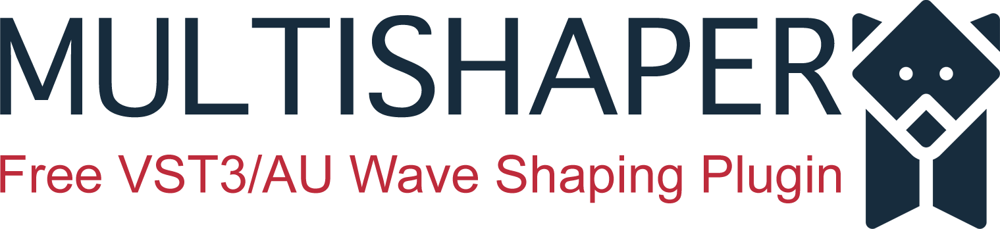

[![Issues][issues-shield]][issues-url]
[![MIT License][license-shield]][license-url]
[![LinkedIn][linkedin-shield]][linkedin-url]

<!-- PROJECT LOGO -->
 

  

  <h3 align="center">MultiShaper</h3>

  

    Free open source VST3/AU wave shaping plugin.
     
    <!-- <a href=""><strong>Explore the docs »</strong></a> -->
    <!--  
      -->
    <!-- <a href="">View Demo</a>
    ·
    <a href="">Report Bug</a>
    ·
    <a href="">Request Feature</a> -->
  

<!-- TABLE OF CONTENTS -->

  
Table of Contents

  <ol>
    <li>
      <a href="#about-the-project">About The Project</a>
      <ul>
        <li><a href="#features">Features</a></li>
        <li><a href="#built-with">Built With</a></li>
      </ul>
    </li>
    <li>
      <a href="#getting-started">Getting Started</a>
      <ul>
        <li><a href="#prerequisites">Prerequisites</a></li>
        <li><a href="#installation">Installation</a></li>
      </ul>
    </li>
    <li><a href="#usage">Usage</a></li>
    <li><a href="#roadmap">Roadmap</a></li>
    <li><a href="#contributing">Contributing</a></li>
    <li><a href="#license">License</a></li>
    <li><a href="#contact">Contact</a></li>
    <li><a href="#acknowledgements">Acknowledgements</a></li>
  </ol>

<!-- ABOUT THE PROJECT -->
## About The Project

[![Product Name Screen Shot][product-screenshot]](https://github.com/vvvar/MultiShaper)

TBD

### Features

TBD

### Built With

TBD

<!-- GETTING STARTED -->
## Getting Started

TBD

### Prerequisites

TBD

### Installation

TBD

<!-- USAGE EXAMPLES -->
## Usage

TBD

<!-- ROADMAP -->
## Roadmap

TBD

<!-- CONTRIBUTING -->
## Contributing

TBT

<!-- LICENSE -->
## License

Distributed under the GPL-3.0 License. See [`LICENSE.md`](https://github.com/vvvar/MultiShaper/blob/master/LICENSE.md) for more information.

<!-- CONTACT -->
## Contact

Vladyslav Voinov - [Linkedin](https://www.linkedin.com/in/vladyslav-voinov-5126a793/) - voinovvladv@gmail.com

Project Link: [https://github.com/vvvar/MultiShaper](https://github.com/vvvar/MultiShaper)

<!-- ACKNOWLEDGEMENTS -->
## Acknowledgements

TBD

<!-- MARKDOWN LINKS & IMAGES -->
<!-- https://www.markdownguide.org/basic-syntax/#reference-style-links -->
[issues-shield]: https://img.shields.io/github/issues/vvvar/MultiShaper?style=for-the-badge
[issues-url]: https://github.com/vvvar/MultiShaper/issues
[license-shield]: https://img.shields.io/github/license/vvvar/MultiShaper?style=for-the-badge
[license-url]: https://github.com/vvvar/MultiShaper/blob/master/LICENSE.md
[linkedin-shield]: https://img.shields.io/badge/-LinkedIn-black.svg?style=for-the-badge&logo=linkedin&colorB=555
[linkedin-url]: https://www.linkedin.com/in/vladyslav-voinov-5126a793/
[product-screenshot]: Resources/screenshot.png
