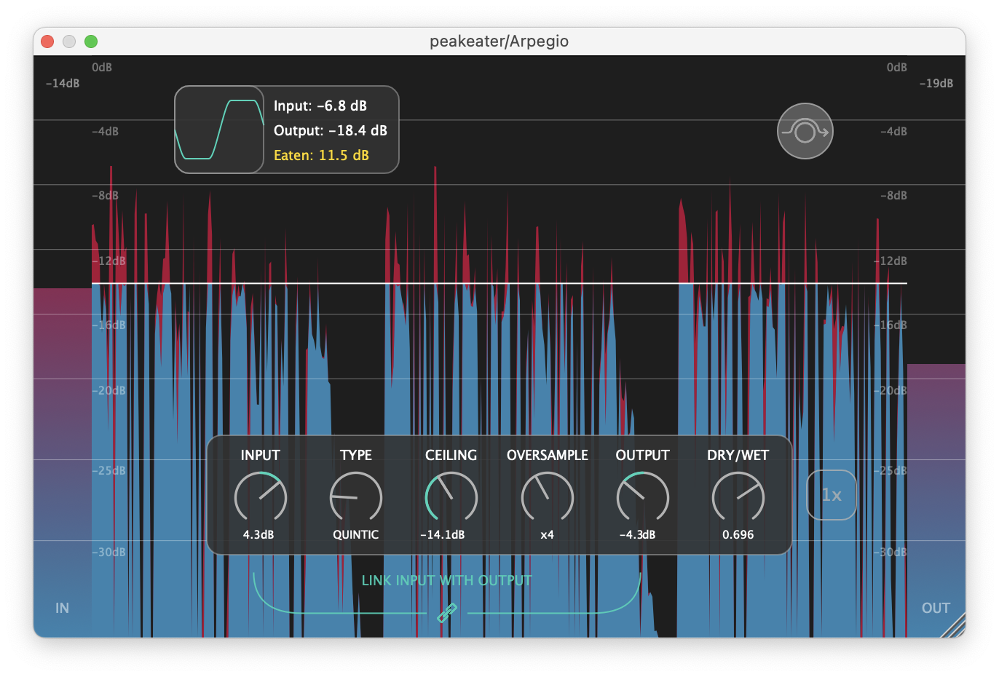
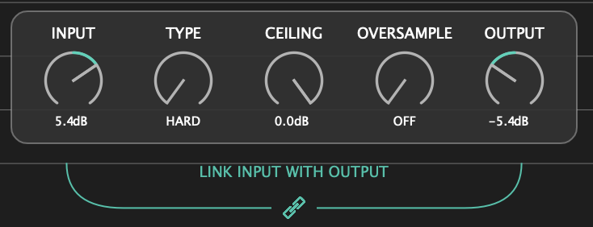
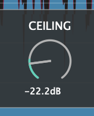
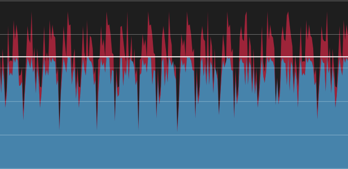
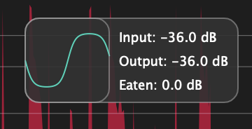
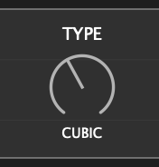
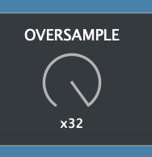
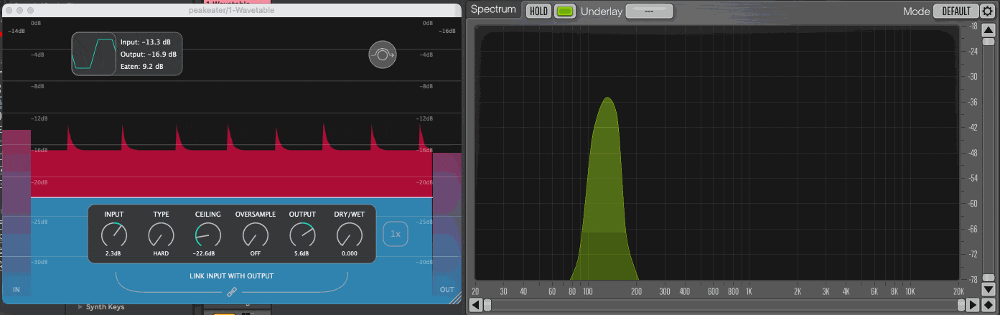
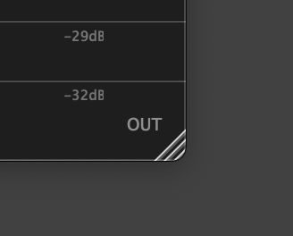

<!-- HEADER -->

<h1 align="center"><a href="https://github.com/vvvar/PeakEater"></a></h1>
<h1 align="center">PeakEater</h1>
<p align="center">Free open-source VST3/AU/LV2/CLAP wave shaping plugin for macOS, Windows and Linux.</p>
<p align="center">
    <a href="https://github.com/vvvar/PeakEater/releases/latest"><b>Download</b></a>
    · <a target="_blank" href="https://github.com/vvvar/PeakEater/issues/new?assignees=&labels=Feature+Request&template=feature_request.md&title="><b>Request Feature</b></a> · <a target="_blank" href="https://github.com/vvvar/PeakEater/issues/new?assignees=&labels=Bug&template=bug_report.md&title=%5BBug%5D"><b>Report Bug</b></a>
</p>



<!-- TABLE OF CONTENTS -->

Table of Contents

- [About](#about)
- [Features](#features)
  - [Input/Output RMS Meters](#rms-meters)
  - [Input & Output Gain](#input--output-gain)
  - [Link Input with Output](#link-input-with-output)
  - [Ceiling Control](#ceiling-control)
  - [Visualizer](#visualizer)
  - [Analyzer](#analyzer)
  - [Configurable Tick marks](#configurable-tick-marks)
  - [Configurable Scaling](#configurable-scaling)
  - [6 Clipping Types](#6-clipping-types)
  - [Oversampling](#oversampling)
  - [Dry/Wet](#dry-wet)
  - [Bypass Mode](#bypass-mode)
  - [Resizing](#resizing)
  - [VST3, AU, LV2 and CLAP Support](#vst3-au-lv2-and-clap-support)
  - [macOS, Windows and Linux Support](#available-on-all-major-platforms)
  - [Verified by Pluginval](#verified-by-pluginval)
- [Installation](#installation)
  - [macOS](#macos)
  - [Windows](#windows)
  - [Linux](#linux)
- [Building from sources](#building-from-sources)
  - [Prerequisites](#prerequisites)
  - [Build](#build)
- [Contributing](#contributing)
- [License](#license)
- [Acknowledgments](#acknowledgments)

<!-- ABOUT -->

## About

PeakEater is a free, easy-to-use wave-shaping plugin. PeakEater lets you choose between different [wave-shaping](https://en.wikipedia.org/wiki/Waveshaper) [functions](https://en.wikipedia.org/wiki/Sigmoid_function) to clip everything above ceiling level. Therefore, you can boost the overall volume of your track safely without worrying that some nasty peak would go above the maximum allowed volume level of your DAW. It supports various <a href="#features">features</a> such as multiple clipping types, oversampling and visualizations of a clipping process that aims to make clipping easy and fun.

## Features

### RMS Meters

<--->

See how loud the signal was before and after the plugin.

### Input & Output Gain

<--->

Adjusts gain level before and after processing. Input Gain is useful when you're either working with too quiet or too loud a signal and Output Gain can be helpful to compensate for loss of gain.

### Link Input with Output



Use linking to automatically set the Output Gain level to the opposite of the Input Gain. For example, if the Input Gain value is set to +5dB then the Output Gain value will be automatically set to -5dB and vice versa.

### Ceiling control



Control your ceiling. Everything above this level would be "eaten". Build-in RMS meter would show you the signal level that comes into the clipper and help you set the threshold.

### Visualizer



Displays magnitude(in dB's) so you can see how peaks were eaten over time.

### Analyzer



Shows approximated RMS that was cut ("Eaten") in the last 2 seconds and current clipping algorithm. Double-click on numbers to drop them to zero and force them re-calculate.

### Configurable Tick marks


Right-Mouse-Click on Visualizer to switch between different tick marks.

## Configurable Scaling


Also, you can switch between linear and non-linear scaling.

### 6 Clipping Types



Choose between 6 clipping functions, from Hard clipping to different types of Soft Clip (Up to Arctangent).
Available clipping functions are:

- Hard
- Quintic
- Cubic
- Tangent
- Algebraic
- Arctangent

You can read more about the difference between Hard and Soft clipping [here](https://www.hackaudio.com/digital-signal-processing/distortion-effects/hard-clipping/) and [here](https://www.hackaudio.com/digital-signal-processing/distortion-effects/soft-clipping/).

### Oversampling



Choose between 2x, 4x, 8x, 16x and 32x oversampling to avoid signal aliasing. You can also turn off oversampling.

> **Note** High values of oversampling may hurt CPU performance.

You can read more about oversampling [here](https://www.nickwritesablog.com/introduction-to-oversampling-for-alias-reduction/).

### <a id="dry-wet"></a> Dry/Wet



Control mix between original and clipped signal. Useful when clipper is used as an exciter.

### Bypass mode


Bypasses all plugin's processing. Useful when you need to make side-by-side comparisons before and after processing.

### Resizing



Drag the corner to change the size of the window.

### VST3, AU, LV2 and CLAP support

   

You can use either VST3, AU (macOS only), LV2 or CLAP type of plugin.

> **Warning** LV2 and CLAP support is experimental and may be unstable.

### Available on all major platforms

  

You can use it on macOS, Windows or Linux.

> **Warning** Linux support is experimental and may be unstable.

### <a id="verified-by-pluginval"></a> Verified by Pluginval 

> pluginval is a cross-platform plugin validator and tester application. It is designed to be used by both plugin and host developers to ensure stability and compatibility between plugins and hosts. [GitHub Project Link](https://github.com/Tracktion/pluginval/tree/develop)

VST3 and AU versions are verified by [Tracktion Pluginval](https://www.tracktion.com/develop/pluginval) for all platforms. Maximum possible strictness level 10 is used. For macOS and Linux - Headless Mode is being used and GUI Mode is used for Windows. Starting from v0.6.5, you may find proofs of Pluginval verification in the "Assets" section on the Release page(*.txt files are split by platform and plugin format).

<!-- INSTALLATION -->

## Installation

1. Go to <a href="https://github.com/vvvar/PeakEater/releases/latest"><b>the latest release</b></a> page.
2. In the Assets section choose the installer for your platform.

### macOS

Supported formats are VST3, AU, LV2 and CLAP.
Tested on: macOS 12.6.2
Processors: Intel(x86_64), Apple Silicon M1+(arm64)

Install the plugin via the **.dmg** file. Drag the plugin in a format of your choice into the folder with your plugins.

> **Note**<br />
> Plugin is build as an Universal Binary. This means that same plugin supports both x86_64 and Apple Silicon(M1+). Just install it and it will automatically run natively with respect to your processor.

> **Note**<br />
> Due to macOS restrictions, you cannot drag files into untrusted directories. Therefore, double click on directory shortcut, open it and drag it directly there.

> **Note**<br />
> VST3 directory is `/Library/Audio/Plug-ins/VST3`<br />
> AU directory is `/Library/Audio/Plug-ins/Components`<br />
> LV2 directory is `/Library/Audio/Plug-Ins/LV2`<br />
> CLAP directory is `/Library/Audio/Plug-Ins/CLAP`<br />

### Windows

Supported formats are VST3, AU, LV2 and CLAP.
Tested on: Windows 10 21H2

Extract the zip and copy the plugin in the format of choice into the folder with your plugins.

> **Note**<br />
> Standard VST3 folder is `C:\Program Files\Common Files\VST3`<br />
> Standard LV2 folder is `C:\Program Files\Common Files\LV2`<br />
> Standard CLAP folder is `C:\Program Files\Common Files\CLAP`<br />

### Linux

Supported formats are VST3, AU, LV2 and CLAP.
Tested on: Ubuntu 18.04

Extract the zip and copy the plugin in a format of your choice into the folder with your plugins.

> **Note**<br />
> Standard VST3 directory is `~/.vst3`<br />
> Standard LV2 directory is `~/.lv2`<br />
> Standard CLAP directory is `~/.clap`<br />

<!-- GETTING STARTED -->

## Building from sources

#### Prerequisites

- [Just](https://github.com/casey/just) 1.13.0+
- [Python](https://www.python.org) 3.11.4+
- [Brew](https://brew.sh) 4.0.23+(macOS only)
- [C++ Build Tools for Visual Studio 2022](https://visualstudio.microsoft.com/downloads/#build-tools-for-visual-studio-2022)(Windows only)
- [Chocolatey](https://chocolatey.org) 1.4.0+(Windows only)

> **Note**<br />
> It is recommended to use PowerShell on Windows

### Building

```sh
just setup
just build
```

Build artifacts will be stored in the `/build/Release/peakeater_artefacts`.

### Code signing on macOS

By default, code signing is turned **off**. To enable it:

1. Make sure you have a valid [Apple Developer ID](https://developer.apple.com/support/developer-id/), [Apple Team ID](https://developer.apple.com/forums/thread/77563) and your signing certificate installed on your Mac(Use [this guide](https://melatonin.dev/blog/how-to-code-sign-and-notarize-macos-audio-plugins-in-ci/) as a starting point. Be aware - they are **not free**)

2. Create a file called `.env` with the following content(replace the value with your Apple Developer ID, Apple ID, password from your Apple ID and Team ID):

```env
MACOS_APPLE_DEVELOPER_ID="Developer ID Application: John Doe (XXXXX6XX42)"
MACOS_APPLE_ID="johndoe@gmail.com"
MACOS_APPLE_PASSWORD="jhnd-oejh-ndoe-jhnn"
MACOS_APPLE_TEAM_ID="JHNDO6E642"
```

3. Setup the `notarytool`(used to notarize DMG):

```sh
just setup-notarytool
```

You should see something like this in the terminal:

```
xcrun notarytool store-credentials "APPLE_SIGN_PROFILE" --apple-id $MACOS_APPLE_ID --password $MACOS_APPLE_PASSWORD --team-id $MACOS_APPLE_TEAM_ID

This process stores your credentials securely in the Keychain. You reference these credentials later using a profile name.

Validating your credentials...
Success. Credentials validated.
Credentials saved to Keychain.
To use them, specify `--keychain-profile "APPLE_SIGN_PROFILE"`
```

After this just run the build. CMake will automatically sign all binaries.

<!-- CONTRIBUTING -->

## Contributing

If you found a bug, please report it using [Bug Template](https://github.com/vvvar/PeakEater/issues/new/choose).
If you have any feedback, feel free to open a feedback ticket using [Feedback Template](https://github.com/vvvar/PeakEater/issues/new/choose).
If you have a specific feature request, please create it using [Feature Request Template](https://github.com/vvvar/PeakEater/issues/new/choose).
If you have a pull request, then just make it using common [Fork & PR flow](https://docs.github.com/en/github/collaborating-with-issues-and-pull-requests/creating-a-pull-request-from-a-fork).

<!-- LICENSE -->

## License

Distributed under the GPL-3.0 License. See [`LICENSE.md`](https://github.com/vvvar/PeakEater/blob/master/LICENSE.md) for more information.

<!-- ACKNOWLEDGEMENTS -->

## Acknowledgments

- [JUCE](https://github.com/juce-framework/JUCE) - Framework for multi-platform audio applications
- [clap-juce-extensions](https://github.com/free-audio/clap-juce-extensions) - CLAP support for JUCE
- [Free Clip](https://gitlab.com/JHVenn/Free-Clip) by [Venn Audio](https://www.vennaudio.com)
- [The Audio Programmer](https://theaudioprogrammer.com) for providing extensive video lessons on audio programming and DSP
- Testers-volunteers and active supporters - [George Budilov](), [Blue Four](https://soundcloud.com/bluefour), Garmata Music
- Everyone who provided active feedback all this time

<!-- MARKDOWN LINKS & IMAGES -->
<!-- https://www.markdownguide.org/basic-syntax/#reference-style-links -->
