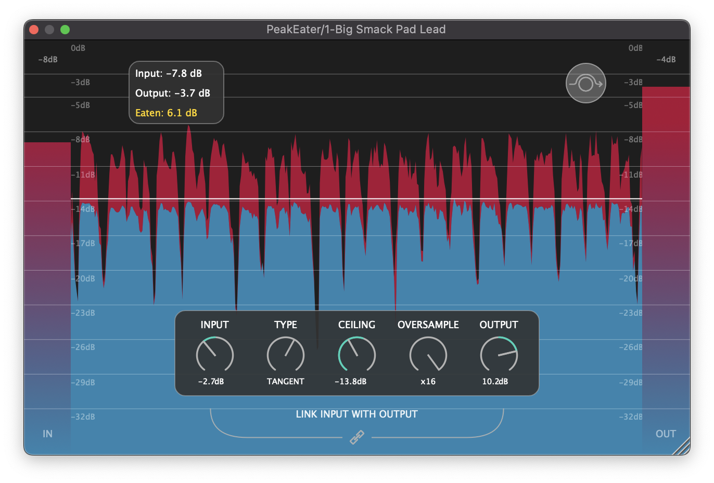
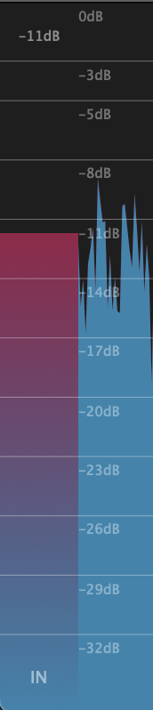
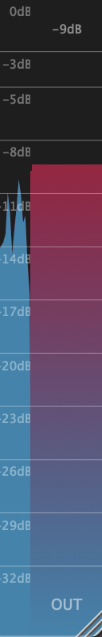
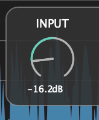
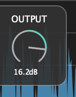
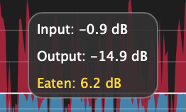
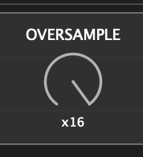
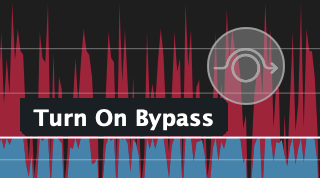
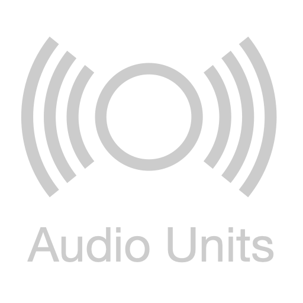

<!-- HEADER -->

<h1 align="center"><a href="https://github.com/vvvar/PeakEater"></a></h1>
<h1 align="center">PeakEater</h1>
<p align="center">Free open-source VST3/AU/LV2/CLAP wave shaping plugin for macOS, Windows and Linux.</p>
<p align="center">
    <a href="https://github.com/vvvar/PeakEater/releases/latest"><b>Download</b></a>
    · <a target="_blank" href="https://github.com/vvvar/PeakEater/issues/new?assignees=&labels=Feature+Request&template=feature_request.md&title="><b>Request Feature</b></a> · <a target="_blank" href="https://github.com/vvvar/PeakEater/issues/new?assignees=&labels=Bug&template=bug_report.md&title=%5BBug%5D"><b>Report Bug</b></a>
</p>



<!-- TABLE OF CONTENTS -->

<details open="open">
  <summary>Table of Contents</summary>
  <ol>
    <li><a href="#about">About</a></li>
    <li>
      <a href="#features">Features</a>
      <ul>
        <li><a href="#input--output-rms-meters">Input/Output RMS Meters</a></li>
        <li><a href="#input--output-gain">Input & Output Gain</a></li>
        <li><a href="#link-input-with-output">Link Input with Output</a></li>
        <li><a href="#ceiling-control">Ceiling control</a></li>
        <li><a href="#visualizer">Visualizer</a></li>
        <li><a href="#analyzer">Analyzer</a></li>
        <li><a href="#6-clipping-types">6 Clipping Types</a></li>
        <li><a href="#oversampling">Oversampling</a></li>
        <li><a href="#bypass-mode">Bypass mode</a></li>
        <li><a href="#resizing">Resizing</a></li>
        <li><a href="#vst3-au-lv2-and-clap-support">VST3, AU, LV2 and CLAP Support</a></li>
        <li><a href="#available-on-all-major-platforms">macOS, Windows and Linux Support</a></li>
      </ul>
    </li>
    <li>
      <a href="#installation">Installation</a>
      <ul>
        <li><a href="#macos">macOS</a></li>
        <li><a href="#windows">Windows</a></li>
        <li><a href="#linux">Linux</a></li>
      </ul>
    </li>
    <li>
      <a href="#building-from-sources">Building from sources</a>
      <ul>
        <li><a href="#prerequisites">Prerequisites</a></li>
        <li><a href="#build">Build</a></li>
      </ul>
    </li>
    <li><a href="#contributing">Contributing</a></li>
    <li><a href="#license">License</a></li>
    <li><a href="#acknowledgements">Acknowledgements</a></li>
  </ol>
</details>

<!-- ABOUT -->

## About

PeakEater is a free, easy to use waveshaping plugin. PeakEater lets you choose between different [waveshaping](https://en.wikipedia.org/wiki/Waveshaper) [functions](https://en.wikipedia.org/wiki/Sigmoid_function) to clip everything above ceiling level. Therefore, you can boost overall volume of your track safely without worying that some nasty peak would go above maximum allowed volume level of your DAW. It supports variours <a href="#features">features</a> such as multiple clipping types, oversampling and visualizations of clipping process that aims to make clipping easy and fun.

## Features

### Input & Output RMS Meters

<--->

See the RMS of signal before and after plugin.

### Input & Output Gain

<--->

Adjusts gain level before and after processing. Input Gain is useful when you're either working with too quiet or too loud signal and Output Gain can be helpful to compensate loss of gain.

### Link Input with Output


Use linking to automatically set the Output Gain level to the opposite of the Input Gain. For example, if the Input Gain value is set to +5dB then the Output Gain value will be automatically set to -5dB and vice versa.

### Ceiling control


Control your ceiling. Everything above this level would be "eaten". Build-in RMS meter would show you signal level that comes into clipper and help you set threshold.

### Visualizer


See how your peaks were eaten with visualizer.

### Analyzer



Shows approximated RMS that was cut("Eaten") in last 2 seconds and current clipping algorithm. Double-click on numbers to drop it to zero and force to re-calculate.

### 6 Clipping Types


Choose between 6 clipping functions, from Hard clipping to different types Soft Clip(Up to Arctangent).
Available clipping functions are:

- Hard
- Quintic
- Cubic
- Tangent
- Algebraic
- Arctangent

You can read more about difference between Hard and Soft clipping [here](https://www.hackaudio.com/digital-signal-processing/distortion-effects/hard-clipping/) and [here](https://www.hackaudio.com/digital-signal-processing/distortion-effects/soft-clipping/).

### Oversampling



Choose between 2x, 4x, 8x, and 16x oversampling to avoid signal aliasing. You can also turn off oversampling.

> **Note** High values of oversampling may hurt CPU performance.

You can read more about oversampling [here](https://www.nickwritesablog.com/introduction-to-oversampling-for-alias-reduction/).

### Bypass mode



Bypasses all plugin's processing. Useful when you need to make side-by-side comparsion before and after processing.

### Resizing


Drag the corner to change the size of the window.

### VST3, AU, LV2 and CLAP support

   

You can use either VST3, AU(macOS only), LV2 or CLAP type of plugin.

> **Warning** LV2 and CLAP support is experimental and may be unstable.

### Available on all major platforms

  

You can use it on macOS, Windows or Linux.

> **Warning** Linux support is experimental and may be unstable.

<!-- INSTALLATION -->

## Installation

1. Go to <a href="https://github.com/vvvar/PeakEater/releases/latest"><b>latest release</b></a> page.
2. In the Assets section choose installer for your platform.

### macOS

Supported formats are: VST3, AU, LV2, CLAP.
Tested on: macOS 12.6.2

Install plugin via **.dmg** file. copy plugin in format of choice into folder with your plugins.

> **Note**<br />
> VST3 directory is `/Library/Audio/Plug-ins/VST3`<br />
> AU directory is `/Library/Audio/Plug-ins/Components`<br />
> LV2 directory is `/Library/Audio/Plug-Ins/LV2`<br />
> CLAP directory is `/Library/Audio/Plug-Ins/CLAP`<br />

### Windows

Supported formats are: VST3, AU, LV2, CLAP.
Tested on: Windows 10 21H2

Extract zip and copy plugin in format of choice into folder with your plugins.

> **Note**<br />
> Standard VST3 folder is `C:\Program Files\Common Files\VST3`<br />
> Standard LV2 folder is `C:\Program Files\Common Files\LV2`<br />
> Standard CLAP folder is `C:\Program Files\Common Files\CLAP`<br />

### Linux

Supported formats are: VST3, AU, LV2, CLAP.
Tested on: Ubuntu 18.04

Extract zip and copy plugin in format of choice into folder with your plugins.

> **Note**<br />
> Standard VST3 directory is `~/.vst3`<br />
> Standard LV2 directory is `~/.lv2`<br />
> Standard CLAP directory is `~/.clap`<br />

<!-- GETTING STARTED -->

## Building from sources

### Prerequisites

- [Git](https://git-scm.com) 2.39.0+
- [CMake](https://cmake.org) 3.15+
- [Python](https://www.python.org) 3.8.1+

### Build

Clone this repo:

```
git clone --recurse-submodules https://github.com/vvvar/PeakEater.git
```

If you're using VS Code, then use Build tasks provided in [settings.json](.vscode/settings.json).
For manual build, checkout proper versions of dependencies:

```
cd Dependencies/JUCE && git checkout 4e68af7 && cd ../clap-juce-extensions/JUCE && git checkout cf93cac
```

Run cmake build:

```
mkdir build && cd build
cmake .. -DJUCE_BUILD_EXAMPLES=OFF -DJUCE_BUILD_EXTRAS=ON
cmake --build .
```

<!-- CONTRIBUTING -->

## Contributing

If you found a bug, please report it using [Bug Template](https://github.com/vvvar/PeakEater/issues/new/choose).
If you have any feedback, feel free to open a feedback ticket using [Feedback Template](https://github.com/vvvar/PeakEater/issues/new/choose).
If you have a specific feature request, please create it using [Feature Request Template](https://github.com/vvvar/PeakEater/issues/new/choose).
If you have a pull request, then just make it using common [Fork & PR flow](https://docs.github.com/en/github/collaborating-with-issues-and-pull-requests/creating-a-pull-request-from-a-fork).

<!-- LICENSE -->

## License

Distributed under the GPL-3.0 License. See [`LICENSE.md`](https://github.com/vvvar/PeakEater/blob/master/LICENSE.md) for more information.

<!-- ACKNOWLEDGEMENTS -->

## Acknowledgements

- [JUCE](https://github.com/juce-framework/JUCE) - Framework for multi-platform audio applications
- [clap-juce-extensions](https://github.com/free-audio/clap-juce-extensions) - CLAP support for JUCE
- [Free Clip](https://gitlab.com/JHVenn/Free-Clip) by [Venn Audio](https://www.vennaudio.com)
- [The Audio Programmer](https://theaudioprogrammer.com) for providing extensive video-lessons on audio programming and DSP
- Testers-volunteers and active supporters - [George Budilov](), [Blue Four](https://soundcloud.com/bluefour), Garmata Music
- Everyone who provided active feedback all this time

<!-- MARKDOWN LINKS & IMAGES -->
<!-- https://www.markdownguide.org/basic-syntax/#reference-style-links -->

[issues-shield]: https://img.shields.io/github/issues/vvvar/PeakEater?style=for-the-badge
[issues-url]: https://github.com/vvvar/PeakEater/issues
[license-shield]: https://img.shields.io/github/license/vvvar/PeakEater?style=for-the-badge
[license-url]: https://github.com/vvvar/PeakEater/blob/master/LICENSE.md
[linkedin-shield]: https://img.shields.io/badge/-LinkedIn-black.svg?style=for-the-badge&logo=linkedin&colorB=555
[linkedin-url]: https://www.linkedin.com/in/vladyslav-voinov-5126a793/
[product-screenshot]: Resources/screenshots/main.png
